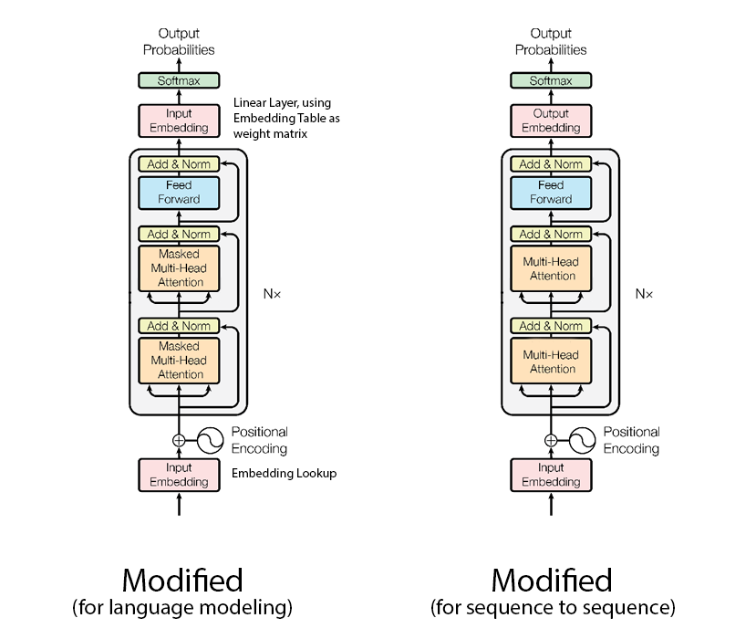

# VN-Accent-Restorer

This project applies multiple deep learning models to the pointless problem of restoring diacritical marks to sentences in Vietnamese.

E.g: ```do an dem trang beo``` → ```đồ ăn đêm trang béo```

## Beamsearch and Language Model

Using a language model, we basically try to guess the next word in the sequence using the previously decoded words to obtain one with the lowest perplexity.
Since using a pure greedy algorithm will make us unable to correct a past mistake, beamsearch will be used along with it.

In this project I implemented two kind neural language models. The traditional RNN model [cite] and a modified version of the Transformer model ([Vaswani et al](https://arxiv.org/abs/1706.03762)), originally used 
for sequence to sequence tasks ([Liu et al](https://arxiv.org/abs/1801.10198)).


Basically we throw away the encoder block, reducing training time and model size in half. Also in the final linear projection layer we try to re-use the word embedding table as the weight matrix ([Press et al](https://arxiv.org/abs/1608.05859))


Although not explicitly mentioned in the original paper, without both attention blocks being masked i.e preventing information from the future to flow back to the current input, training a language model won't work.
The model will cleverly learn to shift the input data to the left by one time step and converge very quickly, without actually understanding anything.

To test the result of Transformer language model:

```python restore_accents.py --vocab_path ckpt_blog_td/vocab.txt --ckpt_path ckpt_blog_td --model t-d --saved_args_path ckpt_blog_td/args.pkl --prime "toi khong thich an gi ca"" --beam_size 3```

To test the result of RNN language model:

```python restore_accents.py --vocab_path ckpt_blog_gru/vocab.txt --ckpt_path ckpt_blog_gru --model rnn --saved_args_path ckpt_blog_gru/args.pkl --prime "toi khong thich an gi ca"" --beam_size 3```

## Sequence to Sequence Model
The same Transformer-Decoder can be used as a end-to-end solution to this problem by modifying the input and training target a little bit.



Note that we're not generating the output autoregressively like in the original Encoder-Decoder architecture. Instead we can simply generate the whole output sentence at once. This is fast, but at the cost of no flexibility e.g no beamsearch allowed.

```python restore_accents.py --vocab_path ckpt_blog_td2/vocab.txt --ckpt_path ckpt_blog_td2 --model t-d-s2s --saved_args_path ckpt_blog_td2/args.pkl --prime "toi khong thich an gi ca""```

## Dataset and Training

Coming soon